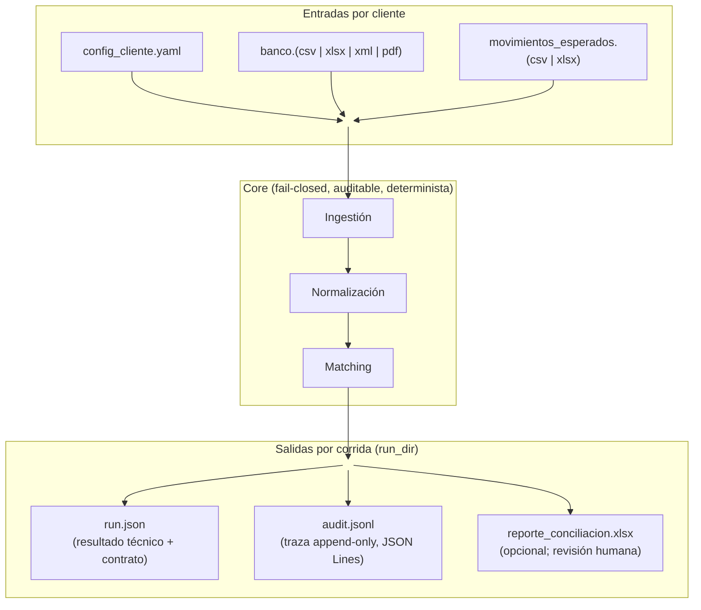
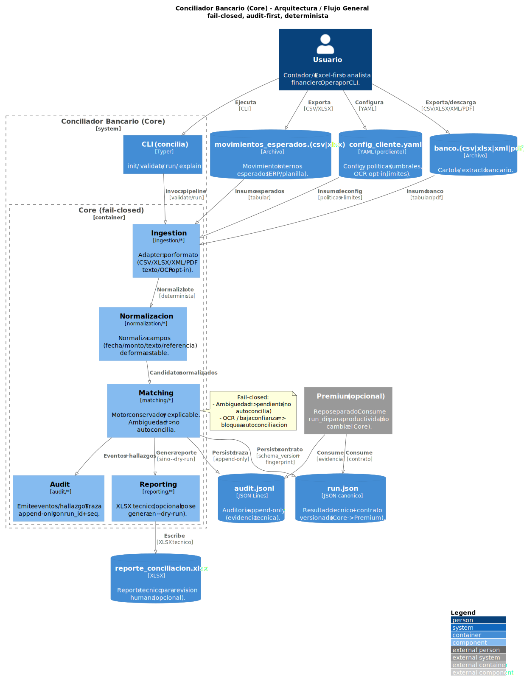
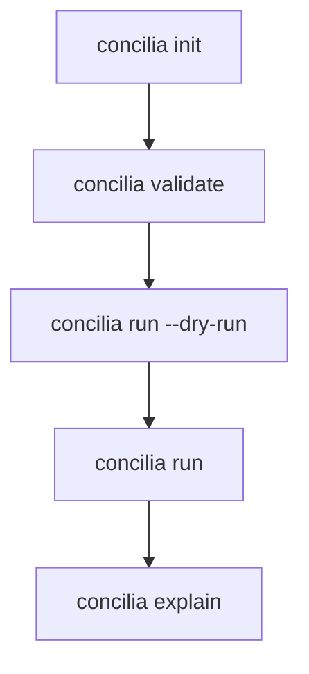

# Conciliador Bancario (MVP)

CLI local (Chile-first) para **conciliación bancaria** con enfoque **fail-closed**, **auditabilidad** y **salidas deterministas**.

[](https://github.com/cortega26/conciliador_bancario/actions/workflows/ci.yml)
[](https://pypi.org/project/bankrecon/)


---

## Vista rápida (inputs → proceso → outputs)

```text
Entradas (por cliente)                    Proceso (core)                     Salidas (por corrida = run_dir)

  config_cliente.yaml   ┐                                                  ┌─ run.json          (resultado técnico + contrato)
  banco.csv|xlsx|xml|pdf ├─> ingestión -> normalización -> matching ->     ├─ audit.jsonl        (traza append-only, JSON Lines)
  esperados.csv|xlsx    ┘         validación estricta + auditoría          └─ reporte_conciliacion.xlsx (opcional; revisión humana)
```



Puntos no negociables:
- **Fail-closed:** ante ambigüedad o baja confianza, el sistema **no autoconcilia**.
- **Sin errores silenciosos:** validación estricta; errores explícitos.
- **Auditable:** evidencia técnica (`run.json`, `audit.jsonl`, XLSX).
- **Determinista:** misma entrada → mismo `run.json` (sin timestamps variables).

---

## Arquitectura / Flujo General



Nota: el archivo fuente (`docs/diagrams/conciliador_architecture.puml`) es la fuente de verdad. El SVG se genera
localmente con PlantUML (ver `docs/diagrams/RENDERING.md`).

## Qué hace (y qué no)

### Qué hace
- Concilia movimientos del **banco** (cartola/extracto) contra movimientos **esperados** (ERP/planilla/registros internos).
- Genera **matches** y **hallazgos** (pendientes, advertencias, riesgos) con explicación.
- Produce artefactos reproducibles para cierre mensual y auditoría.

### Qué NO hace
- No se conecta a bancos, no descarga datos, no usa APIs bancarias.
- No es un ERP ni “reemplaza” criterio contable.
- No “adivina” para maximizar autoconciliación (por diseño, prioriza control de daño).
- No es SaaS: no hay telemetría ni envío de datos (todo corre local).

### Casos borde (comportamiento fail-closed)

Este core está diseñado para **no autoconciliar** cuando el riesgo de error sube o la evidencia es insuficiente. En esos casos genera **hallazgos** y deja trazabilidad en `run.json` y `audit.jsonl` para revisión humana.

Ejemplos comunes:
- Pago parcial: 1 factura pagada en 2+ transferencias.
  - Si el ERP entrega **2+ movimientos esperados** (granularidad real de pago), el core puede conciliar cada transferencia contra su esperado (si no hay ambigüedad).
  - Si el ERP entrega **1 esperado por el total** y el banco trae **2+ abonos**, el core no hace split/merge automático: queda como pendiente/hallazgo (fail-closed).
- Pago agrupado: 2+ facturas pagadas con 1 transferencia (N esperados vs 1 banco). El core no agrupa automáticamente: requiere revisión.
- Comisiones/retenciones/redondeos: si el monto bancario no calza exactamente con el esperado, se reporta discrepancia (no auto-match).
- Reversas/chargebacks/abonos correctivos: se preservan como eventos separados; si generan ambigüedad, quedan como hallazgos.
- OCR (PDF escaneado): siempre baja confianza y por defecto **no autoconcilia**.

Si estos casos aparecen de forma recurrente y tu problema pasa a ser **tiempo humano de revisión**, revisa la sección **Premium** (este repo mantiene el core conservador por diseño).

---

## Quick Start (5 minutos)

### Modelo mental del CLI

- `concilia init`: genera plantillas por cliente (config + CSVs ejemplo).
- `concilia validate`: valida inputs (formato + parseo real) antes de correr.
- `concilia run`: ejecuta pipeline end-to-end y persiste artefactos tecnicos en `run_dir` (`run.json`, `audit.jsonl`, XLSX opcional).
- `concilia explain`: inspecciona un match/hallazgo puntual desde `run.json` (fail-closed si el contrato es invalido).

### 1) Instalar (pipx, recomendado)

```powershell
# Desde PyPI (recomendado):
pipx install bankrecon

# Desde el repo (desarrollo):
pipx install .
concilia --help
```

OCR (opcional para PDFs escaneados):
```powershell
pipx inject bankrecon pdf2image pytesseract Pillow
```

Flujo recomendado (primera vez):



### 2) Inicializar un “cliente”

```powershell
concilia init --out-dir .\mi_cliente
```

Esto crea plantillas:
- `.\mi_cliente\config_cliente.yaml`
- `.\mi_cliente\banco.csv`
- `.\mi_cliente\movimientos_esperados.csv`

### 3) Validar inputs (antes de correr)

```powershell
concilia validate --config .\mi_cliente\config_cliente.yaml --bank .\mi_cliente\banco.csv --expected .\mi_cliente\movimientos_esperados.csv
```

### 4) Ejecutar (modo seguro primero)

```powershell
concilia run --config .\mi_cliente\config_cliente.yaml --bank .\mi_cliente\banco.csv --expected .\mi_cliente\movimientos_esperados.csv --out .\salida --dry-run
```

Luego, para generar XLSX:
```powershell
concilia run --config .\mi_cliente\config_cliente.yaml --bank .\mi_cliente\banco.csv --expected .\mi_cliente\movimientos_esperados.csv --out .\salida
```

### 5) Explicar un caso puntual

```powershell
concilia explain --run-dir .\salida M-<match_id>
concilia explain --run-dir .\salida H-<hallazgo_id>
```

---

## Formatos soportados (MVP)

- Banco: CSV / XLSX / XML / PDF (texto).
- PDF escaneado: **solo** con OCR habilitado (opcional) y siempre con política conservadora (no autoconcilia).
- Movimientos esperados: CSV / XLSX.

---

## Calidad y confianza (lo que mira CI)

Este repo tiene guardrails para bloquear regresiones:
- Formato: **Black**
- Lint: **Ruff**
- SAST: **Bandit**
- SCA (supply-chain): **pip-audit** (vulnerabilidades en dependencias; ver `.pip-audit-ignore.txt`)
- SAST semántico: **Semgrep** (corre en CI sobre Ubuntu; en Windows requiere Docker/WSL)
- Tests: **pytest** (incluye tests “golden” para outputs contractuales)

Comandos locales:
```powershell
python -m pip install -e ".[dev]"

python -m black --check src tests tools
python -m ruff check src tests tools
python -m bandit -c .bandit.yml -r src
python tools/pip_audit_gate.py
python -m pytest -q
```

Semgrep (opcional local):
```powershell
# Requiere Docker o WSL2; en CI ya está integrado.
docker run --rm -v "${PWD}:/src" -w /src returntocorp/semgrep:1.95.0 semgrep scan --config .semgrep.yml --error --metrics=off src
```

---

## Contratos y artefactos (Core → Premium)

El artefacto `run.json` es un **contrato versionado** para consumo por herramientas externas (incluyendo premium).

- Especificación: `docs/contract_run_json.md`
- Glosario de términos: `GLOSARIO.md`

## UX Contracts (anti-regresion)

Este repo trata la UX del CLI como un **contrato verificable**: ante ambiguedad o baja confianza, el core **no**
autoconcilia, y siempre deja evidencia.

- Contratos: `docs/ux_contracts.md`
- Tests de contrato (referencia): `tests/test_e2e_cli.py`, `tests/test_golden_datasets.py`, `tests/test_audit_contract.py`

---

## Documentación

Empiece aquí:
- [Manual de Usuario (RUNBOOK)](RUNBOOK.md)
- [Glosario de Términos](GLOSARIO.md)

Referencia:
- `docs/guia_contadores.md`
- `docs/guia_tecnica.md`
- `docs/agregar_formato.md`
- `docs/contract_run_json.md`
- `docs/ux_contracts.md`
- `walkthrough.md`
- `mvp_checklist.md`

---

## Público objetivo

### Sí
- Estudios contables (persona principal: **contador/a tradicional, multi-cliente, Excel-first**), PyMEs y equipos que
  necesitan un flujo **reproducible** de conciliación con evidencia.
- Usuarios no técnicos o semi-técnicos que puedan ejecutar comandos y preparar archivos (CSV/XLSX/PDF).

### No
- Quien busca integración automática con bancos, sincronización online o una UI gráfica.
- Quien necesita maximizar “auto-match” a costa de riesgo (este proyecto prefiere conservadurismo).

---

## Estado del proyecto

MVP funcional:
- `concilia init`, `validate`, `run`, `explain` operativos.
- Ingestión para CSV/XLSX/XML/PDF texto; OCR opcional.
- Salidas: `run.json`, `audit.jsonl`, `reporte_conciliacion.xlsx`.

Roadmap (alto nivel, sin promesas de fecha):
- Endurecer compatibilidad por formatos bancarios reales (sin romper contrato).
- Mejoras de ergonomía y documentación operativa.

---

## Versionado y releases

- Source of truth: `src/conciliador_bancario/version.py`
- Historial de cambios: `CHANGELOG.md`
- Política (repo público): cada merge a `main` hace bump automático de `patch`, crea tag `vX.Y.Z` y (si está configurado) publica en PyPI.

---

## Premium (opcional)

Este repo OSS se mantiene intencionalmente **conservador** (fail-closed) y enfocado en riesgo/auditoría. El Premium (repo separado) está diseñado para capas de **productividad** que ahorran tiempo humano recurrente, sin cambiar la fuente de verdad del core: **consume** el `run_dir` (`run.json`, `audit.jsonl`, XLSX técnico) y trabaja sobre evidencia.

Ejemplos de problemas que típicamente empujan a Premium:
- Resolución asistida de casos N↔1 (pagos parciales y pagos agrupados), con agrupación y trazabilidad defendible.
- Paquetes de reglas específicas por banco/ERP (reducción de fricción operacional) sin meter heurísticas frágiles en el core.
- Heurísticas de auto-match más agresivas, pero controladas por umbrales, reglas explícitas y auditoría.
- Reportes ejecutivos/listos para cliente y flujos operativos multi-cliente (automatización y presentación).

Referencia (diseño; no implementado en este repo):
- Roadmap: `docs/premium_roadmap.md`
- Arquitectura: `docs/premium_architecture.md`
- Licensing: `docs/premium_licensing.md`
